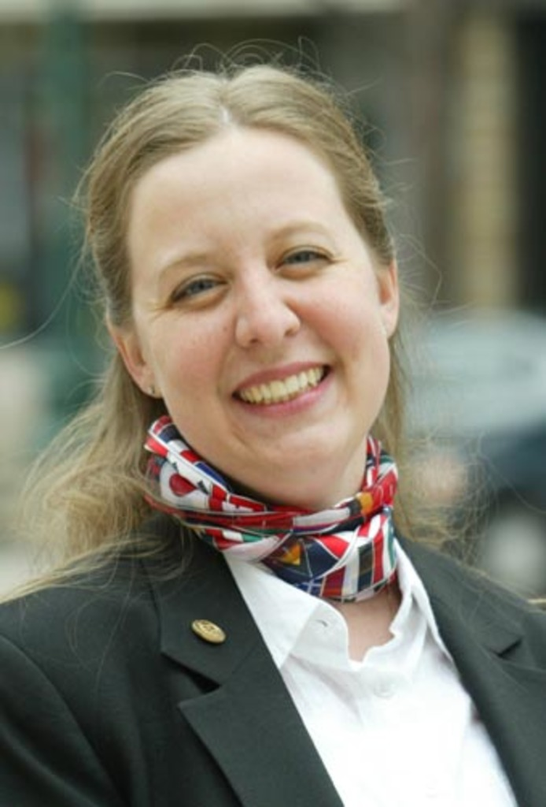

### Documentation on how I solved this task


First of all, I want to thank you for the opporunity for me to solve this take home tasks. The whole process of understanding the problem domains, implementing the solution, fine tuning the parameters and finally triyng to do some optimization on it, was really fun! 

Next, in the follwing text I segmented few steps I've taken to understand the problem and implementing the solution: 


## Setups

1. The main branch contains the final solution, without debugging flags for development prupose.
2. The dev branch contains the debugging。


## Steps

1. Problem understanding: learning from function Signature and ChatGPT
    This step involved understanding the abstract problem of : Given a rectangle area on a picture, detect the biggest shape and bluring it. I used ChatGPT to understand the common approach of solving it.  After a few iterations with ChatGPT, the solution workflow visualiszed as a diagram by ChatGPT looked like [this](image.png)

    From this diagram, I understood a few key concetps: converting to gray scale, converting to black and white using thresholding, and a need for a mask. 

    Also in this step, when it comes to the code, I started by looking at the function signature to understand what data structure is needed. 
    ```c++
    py::array_t<uint8_t> blur_largest_shape_in_rect(
    py::array_t<uint8_t> input_array,
    py::tuple rect_tuple,
    int blur_kernel = 15)
    ```
    Looking at `py::array_t<uint8_t>` as a function return, and `py::array_t<uint8_t> input_array input_array`, I thought this is a two dimensional array by default. And maybe this function takes gray scaled images. I sent an email in a rush to ask Vojta if this functino only takes gray images. But very soon I realised it actually can take n-d array and the dimension of the array is stored in `buffer_info`.

    After these two steps, and looking at the generic code given by ChatGPT, it seemed this is not a very complicated problems to solve. I am ready to iteratively implement it with the help of Github Copilot in VScode. 

    Though at this point, I also realsied there is not sample input data given or performance requierments given. 

2. DevOps and Linter Setup
    Before implementing anything, I needed the setup to work in the container. To ensure a smoother dev experiences and some good practices. Things I did there are:
    - Setting up devcontainer based on Dockerfile, which includes configuring the right paths for packages 
    - Setup linter behavior in `.vscode/settings.json`.


3. Iterated impelmentation with Copilot
    Next, I iteratively started to implement the solution first in `run_pipeline.py`and `cpp_module/cpp_module`. While in Python, understanding there are some requirements for input parameters, and many conditional check is needed for input sanity, I introduced `Pydantic` to the code space to take care of input sanity check in a clear way. 

    After Python implementation is done, I introduced few commented lines in the C++ file, based on the flow chart generated by ChatGPT in the previous step, and implemented it using CoPilot. 

    The whole implementation was rather fast. I had the v0 of the code.

4. Understand the code and cross checking if it's correct
    To understood the code given by CoPilot, given it already looked very similar to code given by ChatGPT, I did some research in OpenCV packages to understand the general approach of `edge detection.` [This article](https://opencv.org/blog/edge-detection-using-opencv/) helped the most.

    Also this step increaed my understanding of the few concetps (see bottom of this page).

    What became clear as well is the need to inspect intermediate reesults to judge how well the pipelien is peforming, by checking the following images:
    - ROI, tune if the right area is selected
    - Gray, the gray image
    - Edges, see what contours are detected
    - Mask, finally the shape that will be blurred. 


4. Pulling sample data, testing pipeline and parameter tunning
    
    At this point, it became clear that I need to pull some sample data myself for testing the pipeline. Given Egonym works with facial data, I then naively pulled a good looking portriat from internet, the smiling lady image. But also thanks to this portriat, later helped me digged into the parameter tuning. 

    I inspected the program run result for the 
    
    

    it blurred to match area. After digging it deeper, the problem was the ill-generated mask. Turns out tuning the mask was not as easy as it apepars. The detected edges through Canny directly influence how the Mask will look like. Getting a clearer picture as training data makes the edge detectoin easier. Considering this, I changed my training data from [A smiling laday with scarf](./input_images_test/1/smiling_lady.jpg) to a [standard linkedin protrait picture](./input_images_test/2/better_protrait_rect160_1_200_240.jpg). The edges and masks for the lady was returned as [this](./report/smiling_lady_edges.jpg) and the mask was only one contour [(seen here)](./report/smiling_lady_mask.jpg). 

    In contrast, for the same parameter, without changing anything, the [edge picture for the standard linkedin protrait was ](./output_images_test/report/better_protrait_rect160_1_200_240_edges.jpg) and [the mask was ](./output_images_test/report/better_protrait_rect160_1_200_240_mask.jpg). At least, this time the mask was a contour that just missed one closing line.

    After settling with the second picture, I tuned the following parameter:
    - The hysteries threshould of the Canny function.
    - The blur kernnel in the first Gaussina Blur function.

    Tunining them lead to a little bit better results: [a more detailed edges](./report/tunning/better_protrait_rect160_1_200_240_edges.jpg) and at least [a closing mask](./report/tunning/better_protrait_rect160_1_200_240_mask.jpg).

    From here, I then asked AI on how to improve it better. Go suggestions to apply dilataion, or erosion. In the end, after some trial and error, I got the best mask result so far using ```cv::morphologyEx(edges, edges, cv::MORPH_CLOSE...);``` to connect contours and. The end result I got was then [a good edge](./output_images_test/better_protrait_edges.jpg), [a mask with the shape of the head](./output_images_test/better_protrait_mask.jpg), which lead to a [good blur](./output_images_test/better_protrait_rect160_1_200_240.jpg).


    After I got this result with this protrait, I went on and tunned the parameters a little bit and blured other 3 pictures. During this process, I gained more intuitive understanding of different parameters. For example, for the [5 th picture](./input_images_test/5/mens_gromming_rect100_1_400_300.jpg) where the the contrast between the face and cloth color is huge, having a very big paramter for the lower and upperbound of hysteresis threshold gives the best result [as its seen here](./output_images_test/mens_gromming_mask.jpg). Also in this case, controlloing the lower threshold to 180 would be sufficient and upper threshold can be any number bigger than 180.

    After this step, a functioning pipeline complies and builds. 

5. Implemented another solution just using Claude Code CLI and compared the results against it for improvement
    To get the best solution available, before any code was impelmented, I created antoher repo where I asked Claude CLI to implement the whole solution from scratch, for comparison. The out of box code didn't differ meaningfully from my solution above. So not much was gained from this step. 


6. Performance improvement
    Though it's not needed to do performance improvement. I still did 3 iterations with Claude Code CLI just for fun, on a seperate repo from scratch. The procedure is:  
    - Ask Claude to identify the potential performance issues.
    - Ask Claude to implement runtime profilling under debug flag in the C++ and Python file. 
    - Looked up a performance optimization [tutorial](https://www.opencvhelp.org/tutorials/best-practices/performance-optimization/) for openCV.
    - Ask Claude to integrate the advice from the OpenCV and implement the performance optimization it proposed and generate a report. 
    - The report says the optimization using `cv::UMat`didn't improve much, due to maybe data copying between CPU and GPU, also **because I forgot to instal Nvidia drives for my newly setup graphic cards.**
    - After graphic card is intalled, commmisoned Claude to do a final report to describe the optimal solution

    I included the three iterative reports generated by Claude in the report folder of this repo, [v0](./report/PERFORMANCE_OPTIMIZATION_REPORT.md), [V1](./report/PERFORMANCE_OPTIMIZATION_REPORT_V2.md) and [final](./report/FINAL_GPU_PERFORMANCE_REPORT.md).


### Appendix 

### take aways:
> 1. "Color images are often converted to grayscale before applying edge detection techniques like Canny, Sobel, or Laplacian. This simplifies the process by reducing the image to a single intensity channel, making it easier to detect edges based on intensity changes"

> 2. "Since the result is in floating-point format, it’s converted to an 8-bit unsigned format using convertScaleAbs() so it can be displayed or saved properly"

